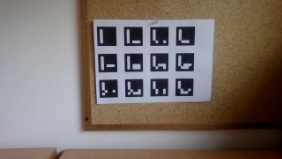
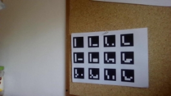
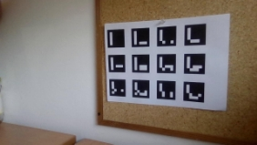
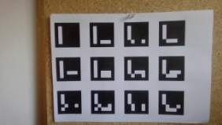

# Camera calibration & Pose estimation using Aruco

markers

# 1  Detection of ArUco Markers

The code uses OpenCV library and the ArUco marker detection algorithm to detect pre- defined markers in frames captured from the default camera. It detects markers and stores their IDs and corner points in vectors. The modified image with detected markers is displayed using the imshow() function. The program exits when the ”Esc” key is pressed.

Figure 1: Different angles [5x4 Aruco board]

# 2  Camera calibration

Camera calibration is a critical process in computer vision that determines the relationship between 3D world coordinates and 2D image coordinates captured by a camera. The process finds intrinsic and extrinsic camera parameters that describe the camera’s internal properties and its position and orientation in space. The program takes command line arguments to set up variables and detect ArUco markers in frames captured from the camera. It checks for enough detected markers and saves calibration parameters to an output file after enough frames have been captured.

After enough frames have been captured, the program saved the output camera matrix and distortion coefficients to the ”camera~~ calibration.yml” file as follow:

Camera Matrix: !!opencv-matrix

data: [ 1.3973080720333924e+03, 0., 4.5175126951013118e+02, 0., 1.5999894836750768e+03, 4.3435188510512131e+02, 0., 0., 1. ] Distortion Coefficients: data: [ -1.4782048972162964e-01, 1.4358620704850680e+00, -2.4863535541773167e-02, -3.2584149497813197e-01, 1.6050225082123124e+01 ]
!!opencv-matrix

 

(a) (b)

 

(c) (d)

Figure 2: Examples of ArUco board images taken for calibrating the camera

# 3  Augmented reality
# 1. Program implementation: pose estimation

The code uses the ArUco marker system and augmented reality techniques to estimate the pose of a marker in the camera frame. It takes command line arguments for the marker dictionary ID, the specific marker ID to detect, and the length of the marker. It detects markers in frames captured from the camera and estimates their pose using the estimatePos- eSingleMarkers function. The code visualizes the orientation and position of the marker by drawing a green frame around it, placing axes at its center, and displaying its coordinates on the screen. This can be used for various applications such as tracking the position and orientation of objects in a camera frame. The code can be easily modified to work with different marker IDs.

 

(a) (b)

Figure 3: Examples of an ArUco marker’s pose detection

# 2. Program implementation: draw cube

It detects markers in a video stream from a camera, estimates their pose, and draws a 3D cube on top of the detected marker. It requires three command line arguments specifying the ID of the dictionary to use, the ID of the marker to detect, and the length of the marker in meters. The program initializes a dictionary and detector object for marker detection and sets the camera matrix and distortion coefficients for the camera being used. It then creates a video capture object and a display window, and enters a loop where it captures frames from the camera and detects markers in the frame. If the desired marker ID is detected, the program estimates the pose of the marker and draws a green frame around it and an axis on top of it. It also detects the corners of a 3D cube in the marker’s local coordinate system, projects them onto the image plane, and draws red circles and lines between them to form the cube. The program continues to run until the user terminates it.

 

(a) (b)

Figure 4: Example of a synthetic cube overlayed on top of an ArUco marker
4
